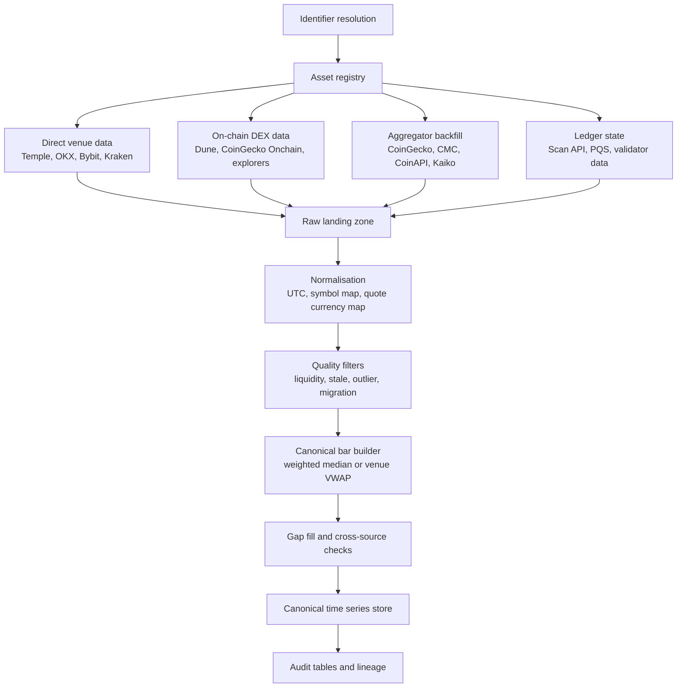

# Best Path to Obtain a Full Historical Price Series for Canton Coin

## Executive summary

The strongest route to a **complete, auditable historical price series for Canton Coin** depends first on resolving **which instrument you mean**. As of 27 July 2026, market data providers list at least two relevant assets: **Canton (CC)**, the native utility token of the Canton Network, and **Wrapped Canton Coin (WCC)** on **BNB Chain**, with CoinGecko listing WCC at contract `0x6050d829f5a5e0ea758d8357ddcdec1381699248`. CoinGecko also lists active markets for CC across **Temple Digital Group**, **Bybit**, **OKX**, **Kraken**, and other venues, which means there is enough venue diversity to construct a robust canonical series if you collect venue-level data rather than relying on a single aggregator. citeturn24view0turn25view0

For **native CC**, the best overall path is a **multi-source hierarchy**: use **direct exchange market data** as the primary source of truth, especially **Temple** for Canton-native market structure and **CEX APIs** such as **OKX** and **Bybit** for trade and candle history; use **Kaiko** if budget permits for institutional-grade benchmark and reconciliation because Kaiko explicitly states it publishes the official **KK_RFR_CCUSD** reference rate and has deep Canton coverage; use **CoinGecko**, **CoinMarketCap**, and **CoinAPI** as secondary backfill and validation layers; and use **Canton Scan / PQS / ledger history** only for internal on-ledger state, transfers, and protocol events, not as a standalone traded-price source. citeturn29search0turn38view0turn36view0turn28search6turn33search1turn33search7

For **wrapped WCC on BNB Chain**, the best path materially changes. Because WCC has a public smart contract, a BNB Chain explorer path, and DEX markets on PancakeSwap, you can add **on-chain DEX reconstruction** via **Dune**, **CoinGecko Onchain / GeckoTerminal**, **The Graph** on supported EVM networks, and **Etherscan API V2** with `chainid=56` for transfer and address-based extraction. In that case, on-chain DEX trades become first-class primary evidence rather than just validation. citeturn25view0turn31view0turn32view0turn35search3turn35search1turn39view1turn39view2

The practical recommendation is therefore:

1. **Resolve asset identity first**: confirm whether the target is **native CC**, **wrapped WCC**, or both.
2. **Build a venue-level raw dataset** from **Temple + OKX + Bybit + other liquid CC venues** for native CC; or from **PancakeSwap/Dune/GeckoTerminal plus any CEX wrappers** for WCC.
3. **Compute canonical bars** from direct trades and depth-weighted or volume-weighted venue prices.
4. **Use Kaiko / CoinAPI / CoinGecko / CoinMarketCap only as secondary layers** for cross-checking, gap filling, and QA, unless your budget or time constraints make an aggregator-only approach necessary. citeturn24view0turn28search6turn41view2turn42search0turn40view0

## Resolve the asset identity first

Before extracting any history, you need to pin down the **identifier set**. CoinGecko’s current listings show **Canton** with API ID `canton-network` and a separate listing for **Wrapped Canton Coin** with API ID `wrapped-canton-coin`, marked as a **BNB Chain Ecosystem** token and linked to the contract `0x6050d829f5a5e0ea758d8357ddcdec1381699248`. CoinGecko also lists CC venue pairs such as **CC/USDA** on Temple and **CC/USDT** on Bybit and OKX, while WCC trades primarily on **PancakeSwap V3 (BSC)**. citeturn24view0turn25view0

That distinction matters because **native CC may not have a public EVM token contract at all**, while WCC does. Dune’s pricing tables require **both blockchain and contract address** for token identification, and Dune explicitly warns that symbols are not unique; CoinMarketCap likewise recommends using permanent **CMC IDs** rather than symbols and notes that `/cryptocurrency/map` returns `name`, `symbol`, and `platform token_address` for cross-reference. citeturn31view1turn40view2

The discovery workflow should therefore be:

| Task | Native CC | Wrapped WCC | Why it matters |
|---|---|---|---|
| Human-readable name | Canton | Wrapped Canton Coin | Avoid confusing native and wrapper assets. citeturn24view0turn25view0 |
| Primary ticker | CC | WCC | Symbols alone are insufficient for production joins. citeturn40view2turn31view1 |
| CoinGecko ID | `canton-network` | `wrapped-canton-coin` | Needed for CoinGecko price and ticker endpoints. citeturn24view0turn25view0turn42search0 |
| CMC ID | Discover via `/cryptocurrency/map` | Discover via `/cryptocurrency/map` | Stable identifier for CMC historical endpoints. citeturn40view2turn14search0 |
| Chain | Canton Network | BNB Chain | Determines whether on-chain DEX tooling is viable. citeturn25view0turn32view0turn11search13 |
| Contract address | May be none if native | `0x6050...99248` | Required for Dune, explorer APIs, and CoinGecko contract queries. citeturn25view0turn31view1turn13search9 |
| Venue symbols | CC/USDA, CC/USDT, CC/USD, CC/KRW | WCC/BSC-USD, WCC/WBNB | Needed for exchange API collection. citeturn24view0turn25view0 |

A precise identifier registry should include: `asset_name`, `canonical_asset_id`, `native_or_wrapped`, `chain`, `contract_address`, `coingecko_id`, `cmc_id`, `venue_symbol`, `base_asset`, `quote_asset`, and `effective_from/effective_to`. This is especially important because CoinGecko now supports webhooks for **contract migration notices** and **cross-chain contract monitoring**, and CoinMarketCap explicitly recommends ID-based production integrations. citeturn13search10turn40view2

## Source and method comparison

The table below ranks the viable methods for building a full historical series.

### Comparison of viable sources

| Source or method | Best use case | Likely coverage for Canton | Granularity | Access method | Required identifiers | Reliability and caveats | Cost profile |
|---|---|---|---|---|---|---|---|
| **Temple Digital Group API / data platform** | Best primary source for native Canton market structure | High relevance for native CC because Temple is native to Canton and exposes orderbook-oriented market data | Real-time market data; order book snapshots; most recent trades; 24h stats | Temple API / platform | Venue symbol, likely account/API auth, market pair | Strongest Canton-native venue path; but institutional/private orientation may limit public self-service historical access. citeturn29search0turn29search3turn29search19 | Likely commercial / account-based |
| **OKX public REST API** | Direct venue trades and candles | Viable where CC is listed on OKX | Trades up to recent 3 months; candles from recent years | REST | `instId` such as `CC-USDT` | Strong for verifiable venue-level history; public, structured, well-documented. citeturn24view0turn38view0 | Public API |
| **Bybit public API + CSV archives** | Direct venue validation and bulk backfill | Viable where CC is listed on Bybit | Recent trades via API; historical OHLCV and trade CSVs downloadable | REST + downloadable CSV | `category`, `symbol` such as `CCUSDT` or exchange-specific spot symbol | Useful secondary venue source; API itself is more recent-history oriented, with long history via downloadable files. citeturn24view0turn21search2turn36view0 | Public API / public downloads |
| **Kaiko** | Institutional benchmark, venue-normalised reconciliation, compliance use | Very strong; Kaiko states it serves as a Canton Super Validator and publishes a CC reference rate | Tick, aggregated market data, order-book depth, analytics, reference rates | Enterprise API / data feeds / explorer | Kaiko asset and instrument codes | Best paid option for benchmark-quality series and audit trails; particularly useful for canonical reference and venue normalisation. citeturn15search0turn28search2turn28search6turn41view1 | Commercial / contact sales |
| **CoinAPI** | Broad multi-exchange backfill and normalised market data | Viable if CC pairs are in CoinAPI metadata | Trades, OHLCV, order books, quotes | REST, WebSocket, MCP, flat files | `symbol_id`, asset/exchange metadata | Broad exchange coverage and bulk delivery options; strong for unified ingestion when venue support exists. citeturn20view0turn20view1turn18search1turn18search3 | Paid tiers; usage-based flat files |
| **CoinGecko coins API** | Fast historical chart backfill and venue discovery | Strong for CC and WCC | 5-minute to daily auto-granularity depending on range | REST | CoinGecko ID, asset platform ID, contract address where applicable | Excellent secondary source; easier to integrate than venue-by-venue collection, but still an aggregator. citeturn24view0turn25view0turn42search0turn39view0 | Demo and Pro; some advanced endpoints paid |
| **CoinGecko Onchain / GeckoTerminal** | Best aggregator for WCC on DEXs | Strong for WCC and any EVM-wrapped deployment | Second, minute, hour, day OHLCV; recent trades | REST | `network`, `token_address`, sometimes pool address | Strongest simple API for wrapped-token DEX history; token OHLCV is aggregated across pools, pool OHLCV gives pair-specific price action. citeturn39view1turn39view2turn39view3 | Pro required for token OHLCV; Analyst for deeper history on some onchain endpoints |
| **CoinMarketCap Pro API** | Historical quotes / OHLCV, metadata resolution | Strong if CC is listed and mapped | Historical quote snapshots and OHLCV | REST | `id` preferred over symbol | Good secondary validation and backfill source; historical access depends on plan tier. citeturn24view1turn40view0turn40view1turn40view2 | Tiered commercial plans |
| **Dune** | Best for WCC or any EVM/Solana-wrapped version on supported chains | Conditional; excellent for WCC-style on-chain assets, not obviously a native Canton path | Minute, hour, day pricing; raw DEX trades | SQL in Dune app/API/DataShare | `blockchain`, `contract_address`, optionally pool/router addresses | Very good for on-chain DEX price reconstruction on supported chains; not a direct native-Canton market-data substitute. citeturn31view1turn30view2turn31view0turn11search13 | Free + paid enterprise options |
| **The Graph** | Pool- and protocol-level DEX indexing on supported chains | Conditional; works for wrapped EVM deployments, not a standard native-Canton route | Entity-level event history depending on subgraph schema | GraphQL via subgraph | Supported network, subgraph ID, pool/token IDs | Useful if WCC trades on a protocol with an existing subgraph; current supported-network list does not show Canton. citeturn32view0turn32view1turn32view2 | Free to query some public subgraphs; network usage for production |
| **Canton Scan API + PQS** | Full internal ledger/event history and audit | Strongest internal on-ledger state path for native Canton | Event history, ACS snapshots, ledger-projected SQL | Scan API bulk endpoints; PQS to PostgreSQL | Validator access, record time ranges, object keys | Essential for protocol-state completeness, but **not a market-traded price feed**. Use for transfers, mint/burn rounds, reward accounting, migrations, activity markers. citeturn33search0turn33search1turn33search3turn33search7 | Operational cost / self-hosted |
| **Explorers and Etherscan API V2** | Contract, transfers, holder history for wrapped assets | Strong for WCC on BNB Chain and other EVM wrappers | Transaction-level transfer history | Explorer UI/API | `chainid`, `contractaddress`, `address` | Good for provenance and memoised backfills; not enough alone for high-quality traded price series. Etherscan V2 unifies 60+ chains. citeturn25view0turn35search3turn35search1turn34search7 | Free and paid API tiers |

### What this means in practice

For **native CC**, the most rigorous path is **exchange-first, benchmark-second, ledger-third**. Temple matters more than Dune; Kaiko matters more than generic retail aggregators; Scan/PQS matter for “what happened on the Canton ledger”, not for “what should the market price bar be”. Kaiko’s Canton material is particularly important because it distinguishes between the governance-driven **Amulet price** and the market-based **KK_RFR_CCUSD** reference rate, which is exactly the distinction you need when reconciling protocol-internal valuation against external secondary-market trading. citeturn15search2turn28search6

For **WCC or any future wrapped deployment**, the centre of gravity shifts towards **on-chain DEX evidence**. Dune’s `dex.trades` plus `prices_dex.*`, CoinGecko Onchain token/pool OHLCV, and explorer-level verification become a strong primary stack because the asset is now contract-based and pool-based on a supported public chain. citeturn31view0turn30view2turn39view1turn39view2

## Extraction examples

The examples below are designed to be production-oriented and to make the unresolved asset identity explicit.

### Identifier discovery examples

**CoinGecko: resolve IDs and contracts**

CoinGecko’s docs expose a full coins list, asset-platform list, token-address metadata, and market-chart endpoints. For native CC you want the **CoinGecko ID**; for WCC you additionally want the **asset platform ID** and **contract address**. citeturn13search0turn13search2turn13search3turn13search4turn42search0turn39view0

```bash
# Native / aggregator identity lookup
curl -H "x-cg-demo-api-key: $CG_KEY" \
  "https://api.coingecko.com/api/v3/coins/list?include_platform=true"

# Get native Canton market history by CoinGecko ID
curl -H "x-cg-pro-api-key: $CG_KEY" \
  "https://pro-api.coingecko.com/api/v3/coins/canton-network/market_chart?vs_currency=usd&days=max&interval=daily"

# Get wrapped-token metadata by contract address
curl -H "x-cg-pro-api-key: $CG_KEY" \
  "https://pro-api.coingecko.com/api/v3/coins/binance-smart-chain/contract/0x6050d829f5a5e0ea758d8357ddcdec1381699248"

# Get wrapped-token market history by contract address
curl -H "x-cg-pro-api-key: $CG_KEY" \
  "https://pro-api.coingecko.com/api/v3/coins/binance-smart-chain/contract/0x6050d829f5a5e0ea758d8357ddcdec1381699248/market_chart?vs_currency=usd&days=max"
```

The historical responses return arrays under `prices`, `market_caps`, and `total_volumes`, each containing `[timestamp, value]` tuples. CoinGecko’s ID-based market-chart endpoint also documents auto-granularity: roughly **5-minute** data for one day, **hourly** for 2–90 days, and **daily** beyond 90 days. citeturn39view0turn42search0

**CoinMarketCap: stable ID first, then historical quotes or OHLCV**

CoinMarketCap recommends resolving the asset with `/cryptocurrency/map` and then using the stable `id` in production. Historical quote series come from `/v3/cryptocurrency/quotes/historical`, and chart-ready candles come from `/v2/cryptocurrency/ohlcv/historical`. CMC’s docs also show that historical depth depends on plan tier: for example, `listings/historical` supports **1 year on Basic**, **3 years on Builder**, and **from 2013 on Startup and above**. citeturn40view2turn40view0turn40view1

```bash
# Resolve CMC ID for Canton / WCC
curl -H "X-CMC_PRO_API_KEY: $CMC_KEY" \
  "https://pro-api.coinmarketcap.com/v1/cryptocurrency/map?symbol=CC"

# Historical quote snapshots
curl -G "https://pro-api.coinmarketcap.com/v3/cryptocurrency/quotes/historical" \
  --data-urlencode "id=<CMC_ID>" \
  --data-urlencode "count=365" \
  --data-urlencode "interval=daily" \
  --data-urlencode "convert=USD" \
  -H "Accept: application/json" \
  -H "X-CMC_PRO_API_KEY: $CMC_KEY"

# Historical OHLCV candles
curl -G "https://pro-api.coinmarketcap.com/v2/cryptocurrency/ohlcv/historical" \
  --data-urlencode "id=<CMC_ID>" \
  --data-urlencode "time_period=daily" \
  --data-urlencode "count=365" \
  --data-urlencode "convert=USD" \
  -H "Accept: application/json" \
  -H "X-CMC_PRO_API_KEY: $CMC_KEY"
```

The CMC response model returns timestamped quote arrays with fields such as `price`, `volume_24h`, and `market_cap` for quote history, and `open`, `high`, `low`, `close`, and `volume` for OHLCV history. citeturn40view0

### Dune SQL examples

Dune is a strong option only if the target asset is on a **supported public chain** and has a **contract address**, such as **WCC on BNB Chain**. Dune’s pricing tables are keyed by `blockchain` and `contract_address`; `prices.hour` and `prices.minute` include `price`, `volume`, and `source`, while `dex.trades` includes `block_time`, `amount_usd`, token amounts, addresses, and router/pool contract addresses. Dune also warns that `prices.minute` is interpolated from hourly anchors and is not the best place to derive “true” on-chain ticks for low-liquidity tokens. citeturn31view1turn30view2turn31view0

**Example: hourly WCC history from Dune prices**

```sql
SELECT
  timestamp,
  price,
  volume,
  source
FROM prices.hour
WHERE blockchain = 'bnb'
  AND contract_address = 0x6050d829f5a5e0ea758d8357ddcdec1381699248
ORDER BY timestamp;
```

**Example: raw DEX trades for WCC**

```sql
SELECT
  block_time,
  project,
  version,
  token_bought_symbol,
  token_sold_symbol,
  token_bought_amount,
  token_sold_amount,
  amount_usd,
  tx_hash,
  project_contract_address
FROM dex.trades
WHERE blockchain = 'bnb'
  AND (
    token_bought_address = 0x6050d829f5a5e0ea758d8357ddcdec1381699248 OR
    token_sold_address   = 0x6050d829f5a5e0ea758d8357ddcdec1381699248
  )
ORDER BY block_time;
```

**Example: build daily OHLCV from raw DEX trades**

```sql
WITH wcc_trades AS (
  SELECT
    block_time,
    amount_usd,
    CASE
      WHEN token_bought_address = 0x6050d829f5a5e0ea758d8357ddcdec1381699248
           AND token_bought_amount > 0
        THEN amount_usd / token_bought_amount
      WHEN token_sold_address = 0x6050d829f5a5e0ea758d8357ddcdec1381699248
           AND token_sold_amount > 0
        THEN amount_usd / token_sold_amount
    END AS px_usd
  FROM dex.trades
  WHERE blockchain = 'bnb'
    AND amount_usd >= 100
    AND (
      token_bought_address = 0x6050d829f5a5e0ea758d8357ddcdec1381699248 OR
      token_sold_address   = 0x6050d829f5a5e0ea758d8357ddcdec1381699248
    )
),
ranked AS (
  SELECT
    date_trunc('day', block_time) AS d,
    block_time,
    px_usd,
    amount_usd,
    row_number() OVER (PARTITION BY date_trunc('day', block_time) ORDER BY block_time ASC)  AS rn_open,
    row_number() OVER (PARTITION BY date_trunc('day', block_time) ORDER BY block_time DESC) AS rn_close
  FROM wcc_trades
  WHERE px_usd IS NOT NULL
)
SELECT
  d,
  max(CASE WHEN rn_open = 1  THEN px_usd END) AS open,
  max(px_usd)                                 AS high,
  min(px_usd)                                 AS low,
  max(CASE WHEN rn_close = 1 THEN px_usd END) AS close,
  sum(amount_usd)                              AS volume_usd
FROM ranked
GROUP BY d
ORDER BY d;
```

These examples should be treated as **WCC / wrapped-token** workflows. For native CC, Dune is not the preferred starting point unless CC later appears on a Dune-supported public chain with documented token identifiers. citeturn32view0turn31view1

### The Graph examples

The Graph exposes subgraphs over **supported networks** via GraphQL endpoints such as Studio endpoints and network gateway endpoints. Because the current supported-network list includes Ethereum, BSC, Base, Solana, Bitcoin and many others, but does **not** show Canton, The Graph is best suited to **wrapped or DEX-traded versions** of the token on supported chains, not to native Canton-ledger market pricing. citeturn32view0turn32view2

A general Uniswap/Pancake-style subgraph query to extract swap history for a WCC pool would look like this:

```graphql
{
  pair(id: "0xPOOL_ADDRESS") {
    id
    reserveUSD
    volumeUSD
    token0 { id symbol name }
    token1 { id symbol name }
  }
  swaps(
    first: 1000
    orderBy: timestamp
    orderDirection: asc
    where: { pair: "0xPOOL_ADDRESS", timestamp_gt: 1735689600 }
  ) {
    id
    timestamp
    amountUSD
    amount0In
    amount0Out
    amount1In
    amount1Out
    transaction { id }
  }
}
```

And the corresponding production endpoint pattern is:

```text
https://gateway.thegraph.com/api/<API_KEY>/subgraphs/id/<SUBGRAPH_ID>
```

The Graph’s docs make clear that query shape depends on the **subgraph schema**, so this example should be adapted to the actual PancakeSwap or Uniswap subgraph that covers the relevant WCC pool. citeturn32view1turn32view2

### Exchange, explorer, and Canton-ledger examples

**OKX** provides public candle history via `GET /api/v5/market/history-candles`, documented as covering “recent years”, and public trade history via `GET /api/v5/market/history-trades`, documented as the last **3 months** with pagination. Candle fields are returned as `[ts, o, h, l, c, vol, volCcy, volCcyQuote, confirm]`, and trade fields include `instId`, `tradeId`, `px`, `sz`, `side`, and `ts`. citeturn38view0

```bash
# OKX candles
curl "https://www.okx.com/api/v5/market/history-candles?instId=CC-USDT&bar=1D&limit=100"

# OKX public trade history
curl "https://www.okx.com/api/v5/market/history-trades?instId=CC-USDT&limit=100"
```

**Bybit** exposes public recent trades at `GET /v5/market/recent-trade` and advertises downloadable public **OHLCV and trade history datasets in CSV format** for backtesting and research. citeturn21search2turn36view0

```bash
curl "https://api.bybit.com/v5/market/recent-trade?category=spot&symbol=CCUSDT&limit=60"
```

**Etherscan API V2** is useful for wrappers and transfer provenance. It unifies **60+ supported EVM chains** behind one API key and supports ERC-20 transfer extraction with optional `contractaddress` filtering. For BNB Chain wrappers, use `chainid=56`. citeturn35search3turn35search1turn35search6

```bash
curl "https://api.etherscan.io/v2/api?chainid=56&module=account&action=tokentx&contractaddress=0x6050d829f5a5e0ea758d8357ddcdec1381699248&address=<WALLET_OR_POOL>&startblock=0&endblock=99999999&page=1&offset=1000&sort=asc&apikey=$ETHERSCAN_KEY"
```

**Canton Scan bulk history** is the best internal-ledger extraction path if you operate inside the Canton ecosystem. The Scan bulk API exposes a stream of **history updates** and **ACS snapshots**, and provides object downloads by key; PQS exports ledger data into PostgreSQL for standard SQL queries. That gives you complete internal chronology for minted/burned state, transfers, rewards, and migrations, which is invaluable for auditing but still not equivalent to a secondary-market execution series. citeturn33search0turn33search1turn33search3turn33search8turn33search7

## Recommended canonical ETL and reconciliation

The recommended architecture is below.



### Recommended pipeline

The pipeline should begin with an **asset registry** that treats **CC** and **WCC** as distinct instruments unless you have official evidence of 1:1 redeemability and a justified decision to stitch or transform them. CoinGecko’s separate listings for Canton and Wrapped Canton Coin are a strong signal that they should be modelled separately by default. citeturn24view0turn25view0

The **raw layer** should preserve native source shape. For exchange trades, store every print with `venue`, `symbol`, `trade_id`, `price`, `size`, `quote_currency`, `timestamp`, and `ingestion_time`. For candles, preserve exchange-native fields such as OKX’s `vol` and `volCcyQuote`. For on-chain DEX trades, keep `tx_hash`, `pool_address`, `router`, `amount_usd`, token amounts, and chain-specific identifiers. For aggregator pulls, store raw JSON payloads alongside parsed series so you can reproduce later transformations. This recommendation is inferential, but it directly reflects the field structures documented by OKX, Dune, CoinGecko, and Etherscan. citeturn38view0turn31view0turn39view0turn35search1

The **canonical bar builder** should prefer **direct venue evidence** over aggregator snapshots. A robust order of precedence is:

| Priority | Source class | Use |
|---|---|---|
| Highest | Direct trades and order books from Temple and liquid CEX venues | Primary truth for native CC bars |
| High | On-chain DEX swaps and pool OHLCV for wrapped deployments | Primary truth for WCC bars |
| Medium | Kaiko reference rate / CoinAPI normalised venue feeds | Cross-venue benchmark and dispute resolution |
| Lower | CoinGecko and CoinMarketCap historical series | Gap fill, validation, and sanity checks |
| Lowest | Ledger-state sources such as Scan/PQS | Event context, not traded price |

This hierarchy follows from the documented nature of each source: venue APIs and DEX trades are execution-level evidence; Kaiko and CoinAPI are market-data normalisers; CoinGecko and CMC are aggregators; Scan/PQS are ledger-state tools. citeturn29search0turn38view0turn31view0turn28search6turn41view2turn42search0turn40view0turn33search1

### Recommended merge logic

Use the following logic for each target bar interval:

1. Build venue-level candidate prices.
   * For trade-based venues, compute interval **VWAP** and final-trade **close**.
   * For order-book venues, compute interval **median mid-price** and **depth-weighted mid** where you have snapshots.
   * For DEX pools, use **trade-derived VWAP** if enough volume exists; otherwise pool OHLCV with an explicit low-confidence flag. citeturn29search0turn38view0turn39view1turn39view2

2. Apply **liquidity filters**.
   * Drop venue bars where notional traded volume is below a floor.
   * Drop bars where quoted spread or depth is obviously impaired.
   * Dune’s own methodology uses minimum **$10k** volume thresholds and multiple outlier filters for dex-derived prices; that is a useful lower bound for wrapped-token DEX handling. citeturn31view1

3. Apply **staleness filters**.
   * Reject bars where the last update is older than an interval-specific freshness ceiling.
   * Dune explicitly forward-fills prices, up to **7 days** for hourly and **2 days** for minute, which is another reason to treat aggregator-minutes as validation rather than truth. citeturn31view1turn30view2

4. Combine surviving venues via **weighted median** or **robust VWAP**.
   * Weight by `sqrt(volume_usd)` or depth-adjusted liquidity rather than raw volume to prevent a single venue dominating when liquidity quality is uncertain.
   * Compare the result to Kaiko, CoinAPI, CoinGecko, and CMC; if deviation breaches a threshold, flag the bar for manual review. This is an inference, but it operationalises documented differences in source class and methodology. citeturn28search6turn41view2turn42search0turn40view0

### Pseudocode for aggregation

```python
def build_canonical_bar(interval_start, interval_end, raw_rows):
    candidates = []

    for venue in raw_rows.group_by("source_venue"):
        stats = compute_interval_stats(venue.rows, interval_start, interval_end)

        if stats.volume_usd < venue.min_volume_usd:
            continue
        if stats.is_stale:
            continue
        if stats.spread_bps is not None and stats.spread_bps > venue.max_spread_bps:
            continue

        candidates.append({
            "venue": venue.name,
            "price_close": stats.close,
            "price_vwap": stats.vwap,
            "volume_usd": stats.volume_usd,
            "depth_score": stats.depth_score or 1.0,
            "quality_score": stats.quality_score,
        })

    if not candidates:
        return gap_fill_from_secondary_sources(interval_start, interval_end)

    for c in candidates:
        c["weight"] = (c["volume_usd"] ** 0.5) * c["depth_score"] * c["quality_score"]

    canonical = weighted_median(
        values=[c["price_vwap"] for c in candidates],
        weights=[c["weight"] for c in candidates]
    )

    return {
        "ts": interval_end,
        "canonical_price_usd": canonical,
        "venues_used": [c["venue"] for c in candidates],
        "total_volume_usd": sum(c["volume_usd"] for c in candidates),
        "confidence": confidence_score(candidates),
    }
```

### Storage format

For storage, the best practical design is:

| Layer | Recommended format | Notes |
|---|---|---|
| Raw venue trades and order books | Partitioned **Parquet** by `source/date/venue` | Cheap to retain, easy to replay |
| Raw API payloads | Compressed JSON blobs + checksum | Preserve original source payloads for audit |
| Curated bars | Parquet or Delta/Iceberg table | Partition by `frequency/date` |
| Dimension tables | Relational table or compact parquet | `asset_registry`, `venue_map`, `migration_map`, `pool_registry` |
| QA tables | Relational or parquet | `anomaly_events`, `gap_fills`, `source_disagreements` |

This is an engineering recommendation rather than a vendor-quoted fact, but it is the most robust way to preserve provenance while keeping your canonical series reproducible.

## Risks, edge cases, and final recommendation

The biggest risk is **joining the wrong asset history**. Because both **CC** and **WCC** exist and are listed separately, you should not build “Canton Coin” history from a single symbol query alone. Resolve identity through CoinGecko ID, CMC ID, chain, and contract; only then collect prices. citeturn24view0turn25view0turn40view2

The next major risk is confusing **protocol-internal valuation** with **secondary-market price**. Kaiko’s Canton documentation is explicit that the **Amulet price** is the official network price produced from super-validator assessments, while **KK_RFR_CCUSD** is the market-based benchmark for secondary markets. Those are related, but they are not interchangeable. In a research-quality dataset, both should be stored: `protocol_reference_price` and `market_traded_price`. citeturn15search2turn28search6

Forks, wraps, migrations, and rebrands require a separate **continuity policy**. CoinGecko now documents webhook use cases for **contract migration notices** and **cross-chain contract monitoring**, and CoinMarketCap’s map endpoint exposes `token_address` to support stable downstream resolution. The right operational rule is to maintain a versioned `asset_registry` and **never splice histories automatically** unless an official migration ratio and effective timestamp are confirmed. citeturn13search10turn40view2

A sound anomaly-detection layer should include:
* **Cross-venue dispersion**: flag if the canonical candidate set exceeds a threshold such as 150–300 bps between median and outer venues.
* **Low-liquidity spikes**: flag any DEX or minor-CEX bar with volume below threshold and a large return.
* **Stale-source drift**: flag if an aggregator bar is unchanged while venue prices move.
* **Wrapper dislocations**: flag if WCC deviates materially from CC for a sustained period without wrapper-specific explanation.
* **Market-structure outliers**: flag spreads and depth collapses.  

Those are methodological recommendations, but they align with documented concerns in Dune’s outlier filtering and with the general differences between direct-trade and interpolated/aggregated series. citeturn31view1turn30view2

The final recommendation is straightforward. If your goal is the **best available full history for native CC**, build the dataset from **Temple + liquid CEX venue data**, validate it against **Kaiko**, and use **CoinGecko / CoinMarketCap / CoinAPI** for backfill and QA; use **Scan/PQS** only to enrich with Canton-ledger events. If your goal is the **best full history for WCC**, use **Dune + CoinGecko Onchain + explorer API + Pancake pool data**, and optionally reconcile against exchange and aggregator sources. If your goal is a **single “Canton Coin” canonical dataset for research**, keep **CC** and **WCC** as separate series and add a derived bridge relationship only after official wrapper documentation confirms the conversion mechanism and continuity rules. citeturn29search0turn38view0turn28search6turn42search0turn40view0turn41view2turn33search1turn31view0turn39view1